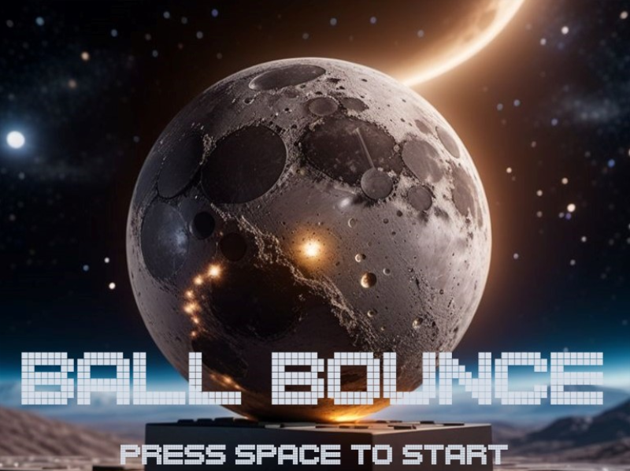
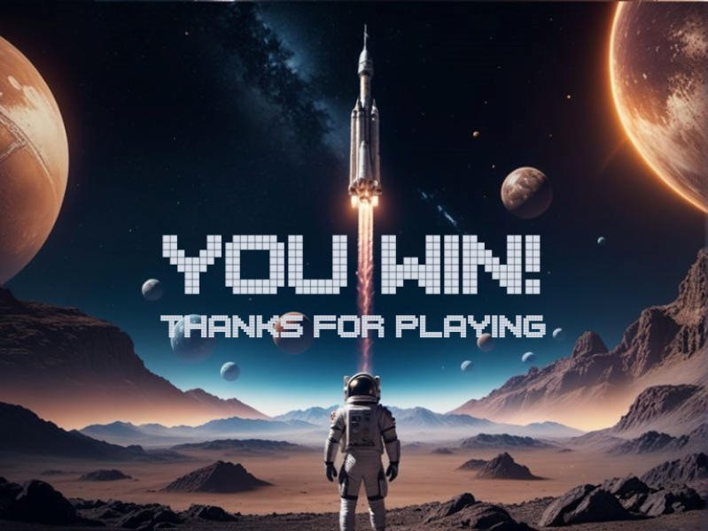
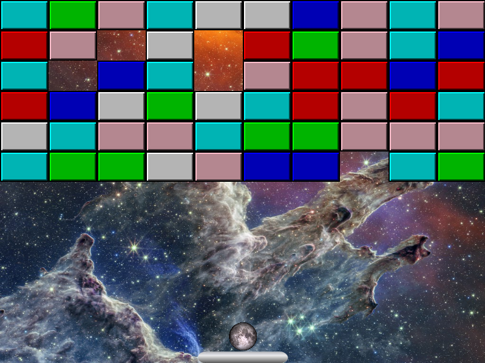

# Ball Bounce

## Project Overview:
Hello! This is my project using C++ and OpenGL to create 2D brick-breaker game I call Ball Bounce. :star_struck:

The premise is simple: use the paddle to bounce the ball into the bricks and clear the level. The game is space themed, so the ball's texture is the moon and each level will take to you a new wonder of space.
There are currently three special types of bricks: the cloning brick, the enlarging brick, and the bouncy brick. The cloning brick spawns another ball at the position of the paddle.
The enlarging brick doubles the radius of the ball that collided with it. The bouncy brick increases the velocity of the ball that collided with it by 10%.

## The Code:

Documentation for the C++ code can be found [here](./ball-bounce/BallBounce). There are some .cpp and .h files in the base folder, but others can be found organized into the game, graphics, and levels folders respectively.

## In Action:

The game opens to the following screen:

Upon pressing space, the game begins at level 1, with a background of the Crab Nebula. This level includes red cloning bricks:

Next, we are taken to level 2, where we can gaze upon the beauty of the Pillars of Creation. This level includes cyan enlarging bricks:

Then, we emerge in level 3, showcasing the incredible Ring Nebula. This level includes pink bouncy bricks:

Finally, we reach level 4, which highlights the gorgeous Carina Nebula. This level combines all special bricks:

If you are skilled enough to complete these levels, you win:

However, there is a hidden feature if you press space on the home screen. Doing this generates endless random levels which could look something like this:

## Try it out!

To try this project out, simply download the repository and open it using Visual Studio 2019. Any other version will not be supported. This is because it was the latest Visual Studio version supported by the dependencies, so I chose it as the base version. Press the play button in the top middle titled Local Windows Debugger and enjoy the resulting gameplay. Thanks for reading this far about my project, I hope you enjoyed! :partying_face:
